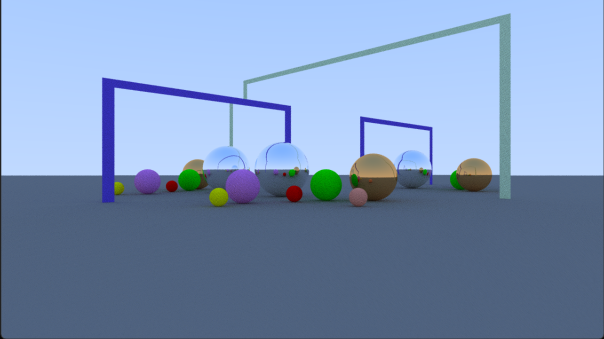

# Path-Tracer
A Path Tracer implemented using the OpenGL API and c++:  

Diffuce and metallic materials supported.  
For diffuse objects, a random direction over the hemishphere on the hit point is calculatd as the scatter ray.  
For metallic objects, the perfect reflection direction (mirror-like reflection) is calculated as the scatter ray.  
To make the application more interactive, on each frame, a single path for pixels is explored and rendered to a frame buffer. On consecutive frames, other light paths are explored and added to the result; thus, the image quality improves by time.  

The camera can be controlled with WASD keys and mouse.  

A short demo can be found [here](https://youtu.be/bd4JVKlihOA).  

A screenshot of the scene:  

Many of the concepts used in this project drives from [Ray Tracing in One Weekend](https://raytracing.github.io/books/RayTracingInOneWeekend.html) book by Peter Shirley, [Introduction to Computer Graphics](https://graphics.cs.utah.edu/courses/cs4600/fall2022/) course by Cem Yuksel at the University of Utah
and the [learnopengl.com](https://learnopengl.com/) website by Joey de Vries.  

[GLM](https://glm.g-truc.net/0.9.8/index.html) library was used for the 3D mathematics.  
The project uses OpenGL 3.3.

